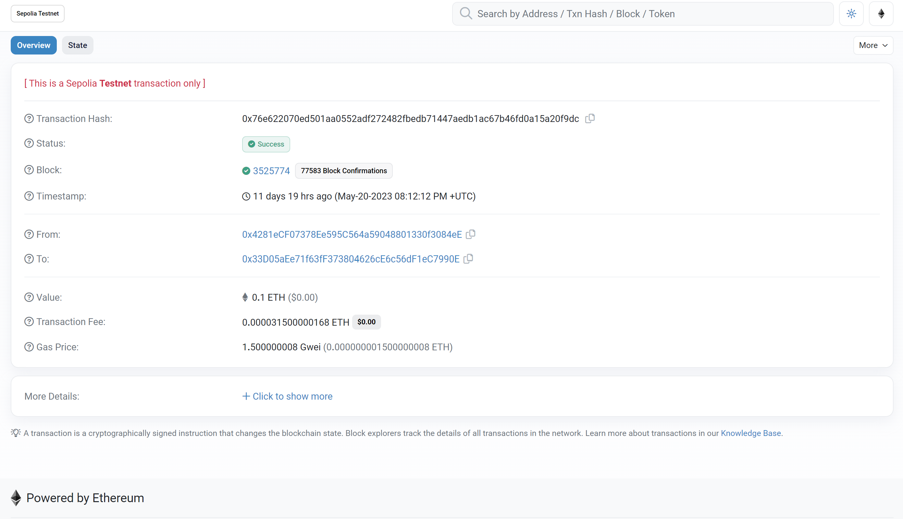
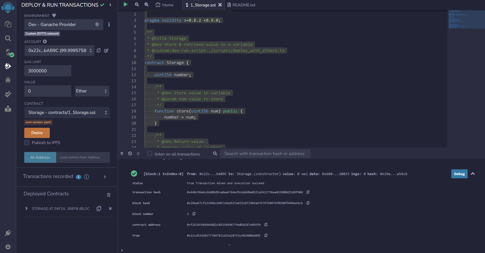
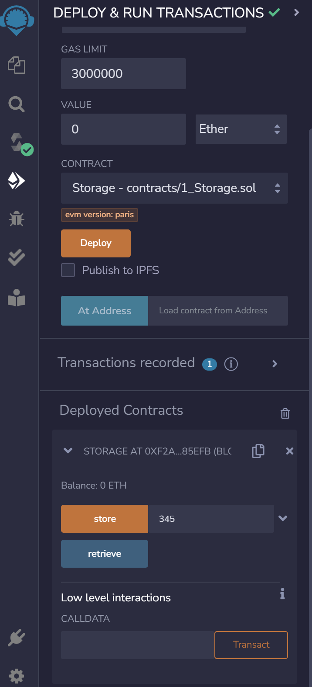

# Blockchain - Ethereum - Solidity

In order to develop Dapps (descentralized applications) you need to deploy smart contracts in a blockchain. In this document, we will develop smart contracts using solidity and deploy/run it on the ethereum blockchain.

We will follow this course: https://github.com/smartcontractkit/full-blockchain-solidity-course-js
https://www.youtube.com/watch?v=gyMwXuJrbJQ


### Basic Elements
1. A wallet with test ethers.
We will use Metamask. When you create a wallet, you get a AccountID: `0x33d05aee71f63ff373804626ce6c56df1ec7990e` given by its publicId or public key. In order to get the privateID or private key, go to metamask account details >> export private key.
You can visualize this account in [Etherscan](https://etherscan.io).


2. An Ethereum blockchain test environment. There are two ways:

- Use a Test Network in Metamask, for example Sepolia.
We need to deposit some fake ethereums, so we go to https://faucets.chain.link/, link with metamask, and it will deposit 0.1 sepolia ethers. You can see this first transaction in etherscan (type the account number)


- Use Ganache, which is also a test network. Ganache is faster than a testnet. So, if you want to quickly test your smart contract, you can use ganache to deploy your smart contract. As testnet is a simulation of mainnet, it takes time for transactions to get processed (just like mainnet). On the other hand, ganache is running on your system so it is fast.
A quick tutorial to connect Ganache to Metamask:
https://www.youtube.com/watch?v=jLFXONkA4KM


> ### Now you are ready to make transactions, send and receive ETH. And of course, you now have ETH to deploy smart contracts in the ETH Network, as well as have ETH to run it. 


3. An IDE for coding, compiling and deploy smart contracts.

### Remix IDE

We will use Remix - online: https://remix.ethereum.org/


#### Initial Steps

1- Check compiler version inside the `pragma` version.

2- Write a typical code:
```Sol
// SPDX-License-Identifier: GPL-3.0

pragma solidity >=0.8.2 <0.9.0;

/**
 * @title Storage
 * @dev Store & retrieve value in a variable
 * @custom:dev-run-script ./scripts/deploy_with_ethers.ts
 */
contract Storage {

    uint256 number;

    /**
     * @dev Store value in variable
     * @param num value to store
     */
    function store(uint256 num) public {
        number = num;
    }

    /**
     * @dev Return value 
     * @return value of 'number'
     */
    function retrieve() public view returns (uint256){
        return number;
    }
}

```
3- Compile.

4- Deploy. Here you need to connect to an Environment. We choose to connect to the Ganache dev test. When we deploy, we can see if the transaction was succesfully deployed. 



5- Run Smart Contract.
Remix offers an interface in where you can interact with the deployed contract and submit a transaction:



In this example, we can enter an `uint256` num in the field and press `store`, which is the name of the function. This will then send a transaction to store this number in the blockchain. We may see in the logs the details of the transaction.

Also, after that, we can also `retrieve` (also name of the function), it will make a call to `Storage.retrieve` and get back the stored number. This type of transction, a simple `view` does not consume gas.

#### Additional resources
https://docs.chain.link/getting-started/deploy-your-first-contract


### Use Remixd to connect Remix IDE to your local directory

`@remix-project/remixd` is an NPM module that intends to be used with Remix IDE web and desktop applications. It establishes a two-way websocket connection between the local computer and Remix IDE for a particular project directory.

Installation:
```bash
npm install -g @remix-project/remixd
```

To run:
```bash
remixd -s ./shared_project -u https://remix.ethereum.org
```

In remix IDE, go to Files > Access File System and connect.

If you want to sync with github, consult these tutorials https://www.youtube.com/watch?v=FBOnbjdIPZo https://www.youtube.com/watch?v=9zZ5mk74n3E

The key now is to learn the basics of Solidity programming language.


